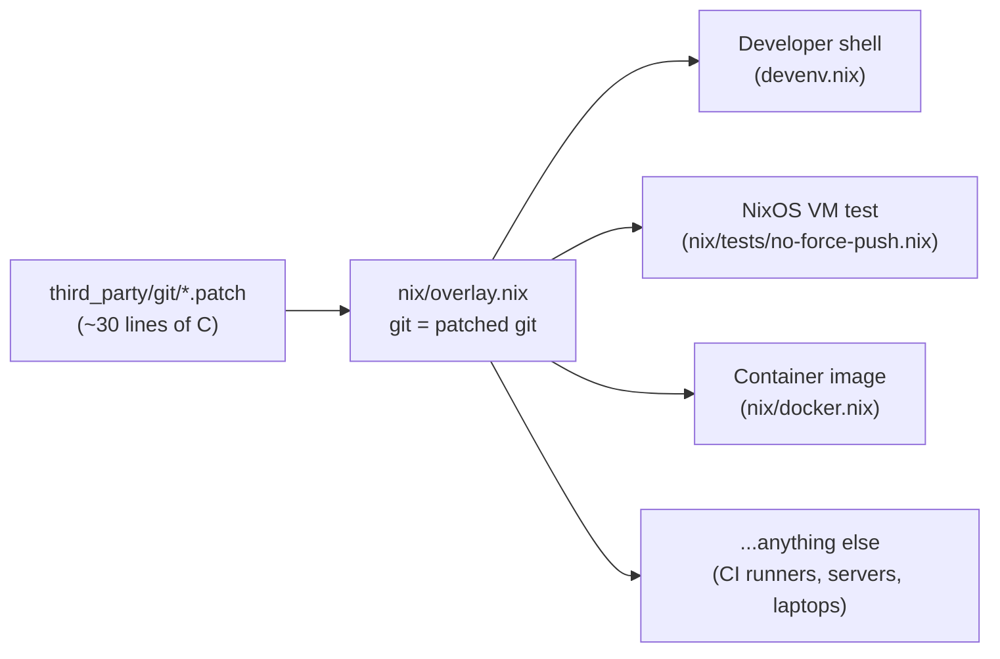
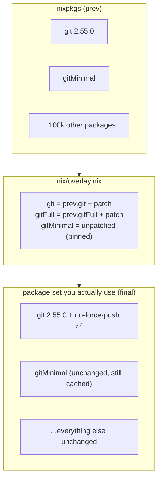
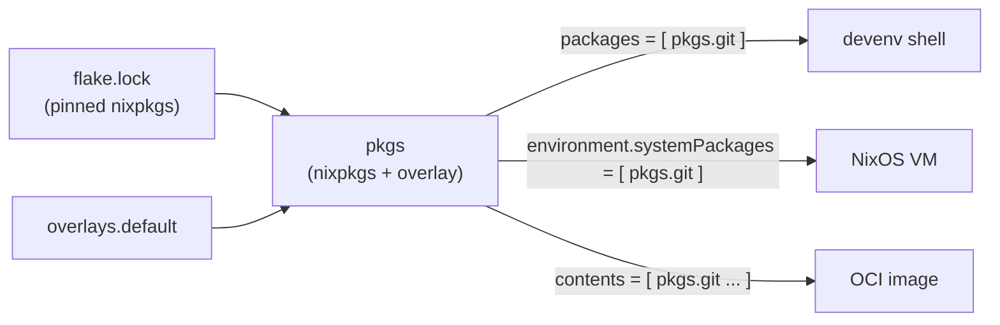
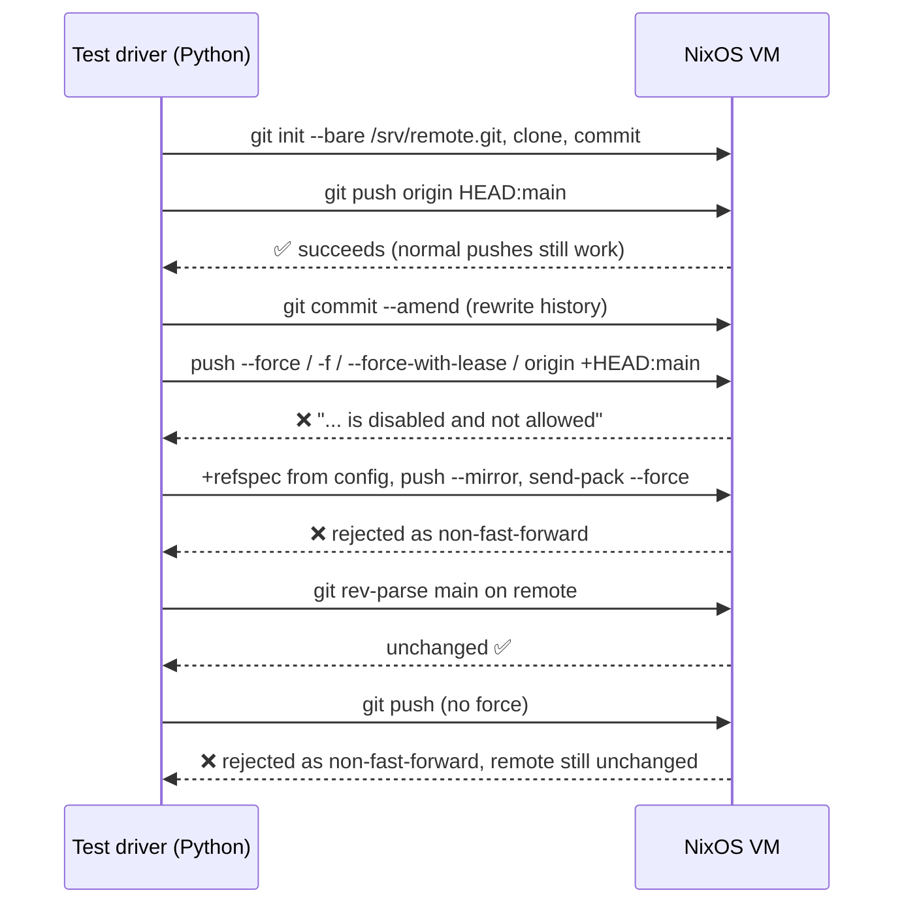

# nix-demo: one patch, everywhere

This repository is a small, complete example of what makes [Nix](https://nixos.org) worth learning. It:

1. **Customises a piece of software**: it patches `git` so that every kind of force push is refused (`--force`, `--force-with-lease`, `+refspec`, `--mirror`, ...).
2. **Defines that change once**: a single file (an *overlay*) describes the change.
3. **Uses that one definition everywhere**:
   - your **developer shell** (devenv)
   - a **virtual-machine integration test** (NixOS test)
   - a **container image** (Docker/OCI)

No copy-pasted Dockerfiles, no "works on my machine", and no forked `git` repository to maintain. You change one thing and every consumer picks it up.

You don't need to know Nix to read this. The concepts are explained as they come up.

---

## The problem being solved

Say your team wants a guard rail: **nobody can force-push and rewrite shared history**. The usual options all have gaps:

| Approach | Problem |
|---|---|
| Server-side branch protection | Only covers the servers you control. Says nothing about laptops, CI or containers. |
| A `pre-push` hook | Opt-in, easy to bypass (`--no-verify`), and must be installed in every clone. |
| A wiki page asking people not to | 🙂 |
| Fork git and ship your own binary | You now maintain a fork, build it for every platform, and distribute it. |

Nix makes the last option cheap. You keep a couple of small patches next to your code and say "use git, but with this patch". Nix builds that variant reproducibly and delivers it to every environment you describe.



---

## Nix in five concepts

### 1. A package is a recipe, not a binary

In Nix a package is a **derivation**: a precise recipe that lists the source code, the exact dependencies (each one a derivation too), the build steps and the patches. Nix hashes the whole recipe, and the hash becomes part of the output path:

```
/nix/store/glfmwphnj0m749m7hc1y59cs15zz145j-git-2.55.0
           └──────── hash of the recipe ────────┘
```

Change anything in the recipe, such as adding one patch, and you get a new hash and a new path. The old and new versions can live side by side without conflict. Two people who build the same recipe get the same result, which is how binary caches can safely hand out prebuilt artifacts.

### 2. nixpkgs is a giant, overridable function

[nixpkgs](https://github.com/NixOS/nixpkgs) is the package collection: more than 100,000 recipes in one repository. It isn't a list of frozen binaries. It's a function that builds a package set, and **every package in it can be overridden**:

- `pkg.override { ... }` changes the *inputs* a package is built with, such as "build git without Python support".
- `pkg.overrideAttrs (old: { ... })` changes the *recipe itself*, such as "add this patch to git's patch list".

`third_party/git/default.nix` uses the second form:

```nix
git.overrideAttrs (oldAttrs: {
  patches = (oldAttrs.patches or []) ++ [
    ./001-disable-force-push.patch
    ./002-disable-force-with-lease-and-plus-refspec.patch
  ];
  doCheck = false;
  doInstallCheck = false;
})
```

In words: "take nixpkgs' git recipe, keep everything, append my patches".

The two patches work at different layers:

| Patch | Where | Blocks |
|---|---|---|
| `001-disable-force-push.patch` | `builtin/push.c` (option parsing) | `git push --force` / `-f` |
| `002-disable-force-with-lease-and-plus-refspec.patch` | `builtin/push.c` and `remote.c` (`set_ref_status_for_push`) | `--force-with-lease`, `+refspec` on the command line, and as a backstop *any* forced ref update: `+` refspecs from `remote.<name>.push` config, `--mirror`, `git send-pack --force` |

`set_ref_status_for_push` is the single place in git that decides whether a ref update may skip the fast-forward check, so patching it closes every route rather than chasing flags one by one. Plain fast-forward pushes and branch deletion keep working. When nixpkgs bumps git to a new version, you get the update for free. You only maintain the patch.

### 3. Overlays: replace a package for everyone who asks for it

Overriding gives you *a* patched git. An **overlay** makes it *the* git. An overlay is a function that takes the package set and returns modifications to it:

```nix
# nix/overlay.nix
final: prev: {
  git = import ../third_party/git { inherit (prev) git; };
}
```

- `prev` is the package set *before* your change, which holds the original git.
- `final` is the package set *after* every overlay has been applied.

From then on, anything that asks for `pkgs.git` gets the patched one: your dev shell, your VM, your container. That is the **single source of truth**. The decision "our git can't force-push" lives in exactly one file.



#### A real-world lesson: overlays ripple

Inside nixpkgs, `gitMinimal` is defined as `git.override { ... }` on top of the *final* `git`. Many packages use `gitMinimal` as a build tool, for example Python's `hatch-vcs`, which feeds into the Python that LLVM builds with, which feeds into `rustc`. Patching `git` therefore changed the recipe of LLVM and rustc as well. Their hashes changed, the binary cache no longer had them, and Nix began compiling a compiler toolchain from source.

This is Nix being *correct*, not broken: those packages really were built with a different git. The fix is a deliberate choice in `nix/overlay.nix`. `gitMinimal` is rebuilt from the original, unpatched git with the same arguments nixpkgs uses, so its hash goes back to matching upstream:

```nix
gitMinimal = prev.git.override {
  withManual = false; osxkeychainSupport = false; pythonSupport = false;
  perlSupport = false; rustSupport = false; withpcre2 = false; ...
};
```

Users get the patched git, and the build toolchain stays identical to upstream and cached. Nix makes the blast radius of a change *visible and controllable*: `nix why-depends` shows exactly how one package reaches another.

### 4. Flakes: pin everything, expose outputs

`flake.nix` is the project's entry point. It does two jobs:

- **Pins inputs.** `flake.lock` records the exact revision of nixpkgs used. Everyone, on any machine, today or in two years, evaluates the same package set.
- **Declares outputs.** These are the things this repository provides:

| Output | What it is | Command |
|---|---|---|
| `overlays.default` | The overlay itself, reusable by other flakes | — |
| `packages.<system>.git` | Patched git | `nix build .#git` |
| `packages.<system>.gitFull` | Patched git with all optional features | `nix build .#gitFull` |
| `packages.<system>.dockerImage` | Container image tarball | `nix build .#dockerImage` |
| `checks.<system>.no-force-push` | NixOS VM integration test | `nix build .#checks.x86_64-linux.no-force-push` |

Because the overlay is itself an output, **another project can consume it** by adding this repository as an input and applying `overlays.default`. That gets them the same patched git without copying any files. That's composition.

### 5. Same description, many targets

Nix can build far more than packages. With the same language and the same package set you can describe a dev environment, a whole operating system or a container image. Each consumer below references `pkgs.git` and nothing more. None of them knows about the patch.



---

## The three consumers

### Developer shell: `devenv.nix`

[devenv](https://devenv.sh) is a friendly layer on top of Nix for per-project development environments. Two lines matter here:

```nix
overlays = [ (import ./nix/overlay.nix) ];   # use our package set
packages = [ pkgs.git ];                      # put git on PATH
```

```console
$ devenv shell
$ git push --force
fatal: force push is disabled and not allowed
```

`devenv test` runs `enterTest`. It creates a throwaway bare repository, pushes a commit, rewrites history, and checks that `--force`, `-f`, `--force-with-lease`, `origin +HEAD:main` and a `+` refspec from config are all refused.

### Integration test: `nix/tests/no-force-push.nix`

This is a **NixOS test**. Nix builds a complete Linux virtual machine whose configuration is also written in Nix, boots it under QEMU/KVM, and drives it from a Python test script. The VM uses the same package set as everything else:

```nix
nodes.machine = { pkgs, ... }: {
  environment.systemPackages = [ pkgs.git ];
};
```

The node doesn't apply the overlay itself. `runNixOSTest` hands every VM the (read-only) package set it was called with, and `flake.nix` builds that set with the overlay already applied. The test script's first assertion checks that the `git` on the VM's `PATH` is that exact store path.

The test script then exercises real behaviour:



The test is a derivation like any other, so `nix flake check` runs it. A passing result is cached, and it only runs again when something it depends on changes.

### Container image: `nix/docker.nix`

```nix
pkgs.dockerTools.buildLayeredImage {
  name = "git-no-force-push";
  contents = with pkgs; [ git bashInteractive coreutils cacert ];
  config.Entrypoint = [ "${pkgs.git}/bin/git" ];
}
```

There's no Dockerfile, no `apt-get` and no base image. Nix already knows the exact dependency closure of `git`, so the image holds those store paths and nothing more. `buildLayeredImage` spreads them across layers so that unchanged dependencies are shared between image versions. The image is reproducible: the same inputs give the same image.

```console
$ nix build .#dockerImage
$ podman load < result        # or: docker load < result
$ podman run --rm git-no-force-push:latest --version
```

---

## Repository layout

```
.
├── flake.nix                       # entry point: inputs (pinned nixpkgs) + outputs
├── flake.lock                      # exact revisions of every input
├── devenv.nix / devenv.yaml        # developer shell, uses the overlay
├── nix/
│   ├── overlay.nix                 # THE single source of truth: git → patched git
│   ├── docker.nix                  # OCI image built from pkgs.git
│   └── tests/
│       └── no-force-push.nix       # NixOS VM integration test
└── third_party/
    └── git/
        ├── default.nix             # overrideAttrs: append our patches to nixpkgs' git
        ├── 001-disable-force-push.patch
        └── 002-disable-force-with-lease-and-plus-refspec.patch
```

`third_party/<name>/` is a convention for local modifications to upstream software. Every custom patch is numbered and named by purpose, and nothing else in the repository needs to know it exists.

---

## Try it

Prerequisites: [Nix](https://nixos.org/download) with flakes enabled. The developer shell needs [devenv](https://devenv.sh). The VM test needs Linux with KVM.

```console
# Build the patched git and try it
nix build .#git
./result/bin/git push --force        # → fatal: force push is disabled and not allowed

# Developer shell + its tests
devenv shell
devenv test

# Boot a VM and run the integration test
nix build .#checks.x86_64-linux.no-force-push -L

# Build and load the container image
nix build .#dockerImage && podman load -i result   # or: docker load < result
podman run --rm git-no-force-push:latest push --force   # → fatal: force push is disabled and not allowed

# Everything at once
nix flake check
```

---

## Why this pattern matters

The patch here is small on purpose. The pattern works for any software:

- **Customise anything.** Patch a CVE fix ahead of upstream, change a compile-time flag, drop an unwanted feature, or apply vendor fixes. Any package in nixpkgs can be overridden in a few lines.
- **Single source of truth.** The decision lives in one overlay. Dev shells, CI, VMs, containers and production machines can't drift apart, because they all evaluate the same definition.
- **Composition.** The overlay is a flake output, so other projects can stack it with their own overlays, like middleware for a package set.
- **Reproducibility.** Pinned inputs and content-addressed outputs mean "it built last week" stays true. Binary caches make it fast.
- **Testable infrastructure.** The guarantee "force push is impossible" isn't a hope. It's checked in a booted VM on every change.
- **Visible blast radius.** Nix shows you exactly what a change affects, down to the dependency chain, as the `gitMinimal` story above shows.

---

## Credits

`third_party/git` is ported from [ghuntley/loom](https://github.com/ghuntley/loom/tree/trunk/third_party/git). `001` has been rebased onto git 2.55.0, the version in the pinned `devenv-nixpkgs/rolling`. `002` is new in this repository.
